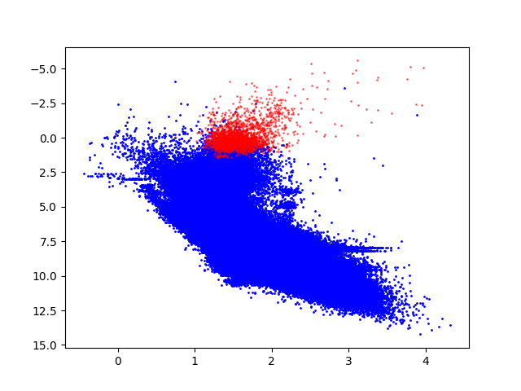

# Analisis de estrellas extraidas con el catálogo de gaia

Para realizar la diferencia entre estrellas pertenecientes a la secuencia principal y estrellas pertenecientes a la rama
de las rojas gigantes (RGB) en una busqueda ADQL de gaia es importante extraer los parámetros que me determinan
su ubicación.

Con base en la teoría estudiada en el curso de astrofísica estelar, se llega a que las estrellas que pertenecen 
a esta sección del diagrama se caracterizar por:

-	Tener un radio $R_{star} > 8 R_{sun}$
- 	Una temperatura efectiva menor a $6000 K$
-	Tener una magnitud absoluta $M_g < 3$

A continuación se muestra el resultado obtenido con estas restricciones:

En el eje y podemos encontrar la magnitud absoluta $M_g$, mientras que en el eje x podemos encontrar el color. Podemos
notar como solo las estrellas en la parte superior izquierda del diagrama HR cumplen las condiciones para denominarse
como gigantes rojas. Esto es congruente con la teoría, ya que la estrellas que se encuentrar en esta etapa evolutiva
aumentan el tamaño de sus capas exteriores, y por consecuente su luminosidad.
